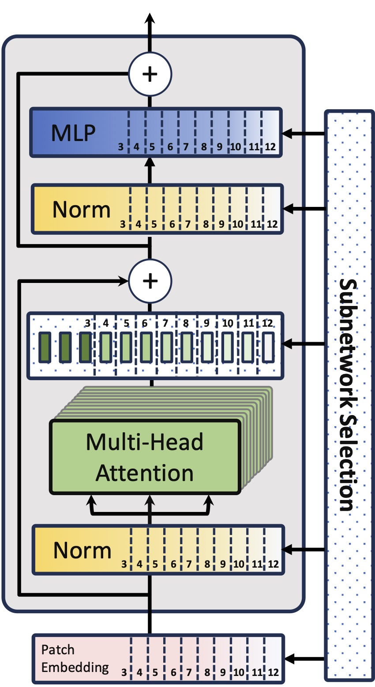
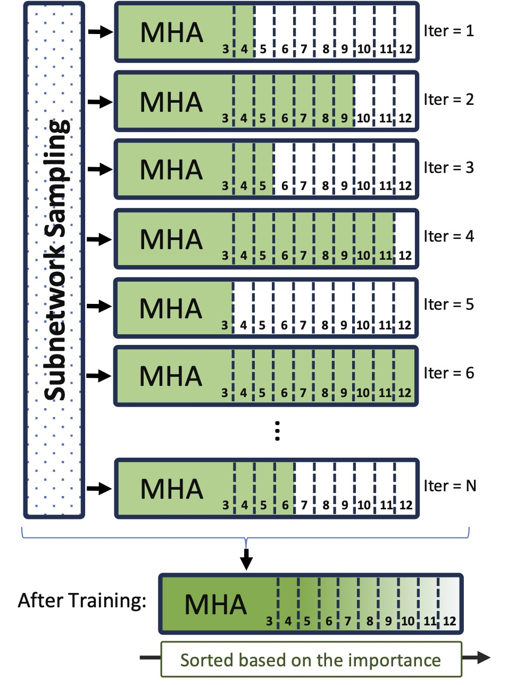
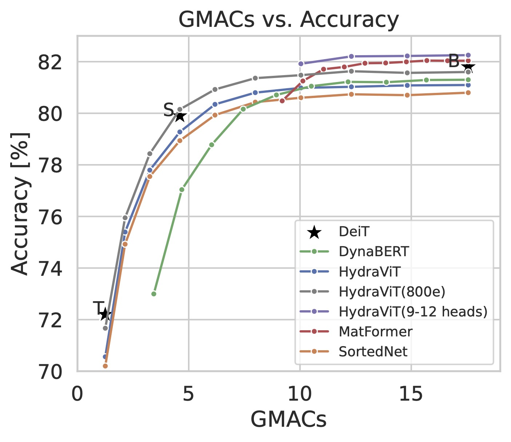
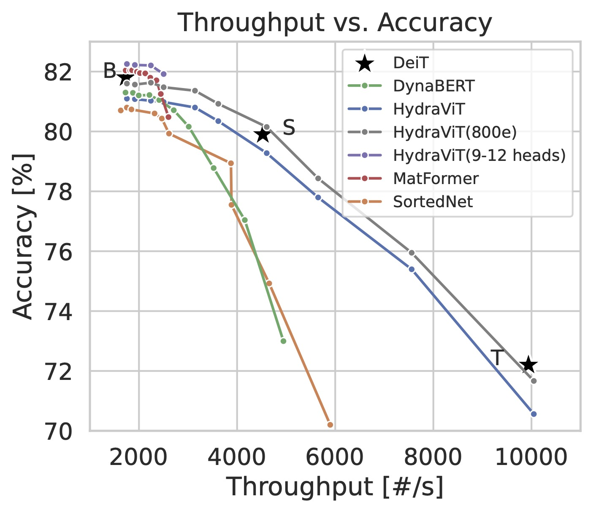

# HydraViT: Stacking Heads for a Scalable ViT

This repository contains the official code for reproducing the results presented in the paper [HydraViT: Stacking Heads for a Scalable ViT (NeurIPS'24)](https://openreview.net/forum?id=kk0Eaunc58).

## About HydraViT
The architecture of ViTs, especially the Multi-head Attention (MHA) mechanism, imposes significant computational and memory demands, making it challenging to deploy them on resource-constrained devices, such as mobile phones. To address this challenge, multiple models of varying sizes are typically used, but this introduces overhead in training and storage. We introduce HydraViT, a novel approach that leverages the stacking of attention heads to create a scalable Vision Transformer capable of adapting to different hardware environments.

#### Architecture & Training
<p style="display: flex; justify-content: center; align-items: center; gap: 20px;">
    
    
</p>

#### Results

<p style="display: flex; justify-content: center; align-items: center; gap: 20px;">
    
    
</p>

## Getting Started

- `python3 -m venv venv` to create a virtual environment
- `source venv/bin/activate` to activate it
- `pip install -r requirements.txt` to install the required pip packages

We provide the models for our main contributions at https://doi.org/10.5281/zenodo.14300201.

The underlying dataset is ImageNet1K (ILSVRC 2012), which can be retrieved from https://www.image-net.org/.


## Training Scripts

For training HydraViT run the following command:
```
./distributed_train.sh <number of GPUs> <path/to/imagenet> --config args_hydravit.yaml --model hydravit_dyn_patch16_224 --workers 8 --epochs 300 --drop-p 1 --heads 3 4 5 6 7 8 9 10 11 12
```
This will train HydraViT with 3 to 12 attention heads with uniform subnetwork sampling. Note that this requires 2 GPUs equivalent to an A100. 

Adding the flag `--weights <w1> <w2> ...` enables weighted subnetwork sampling, where the position of the weights corresponds to the position of the `--heads` flag.

## Validation Scripts

For validating the accuracy run the following command:
```
python3 validate.py <path/to/imagenet/val> --model hydravit_dyn_patch16_224 --checkpoint <path/to/checkpoint> -b <batch size> --use-ema --heads 3
```
This will evaluate the checkpoint at the chosen amount of heads, where 3 heads corresponds to the architecture of DeiT-tiny, 6 heads corresponds to DeiT-small, and 12 heads corresponds to DeiT-base.

For validating throughput run:
```
python3 validate_throughput.py <path/to/imagenet/val> --model hydravit_dyn_patch16_224 -b 512 --heads 3
```

For validating MACs run (requires `pip install deepspeed`):
```
python3 validate_macs.py <path/to/imagenet/val> --model hydravit_dyn_patch16_224 -b 1 --heads 3
```

For validating RAM usage and model parameters run (requires `pip install torchinfo`):
```
python3 validate_memory.py <path/to/imagenet/val> --model hydravit_dyn_patch16_224 --heads 3
```

## Citing HydraViT

```
@InProceedings{haberer2024hydravit,
    author    = {Haberer, Janek and Hojjat, Ali and Landsiedel, Olaf},
    title     = {HydraViT: Stacking Heads for a Scalable ViT},
    booktitle = {The Thirty-eighth Annual Conference on Neural Information Processing Systems},
    month     = {December},
    year      = {2024},
    url       = {https://openreview.net/forum?id=kk0Eaunc58}
}
```